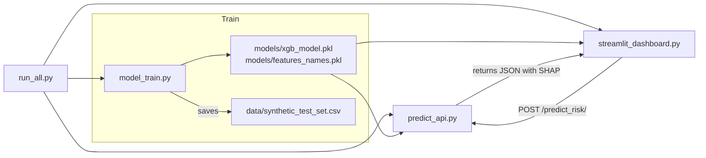
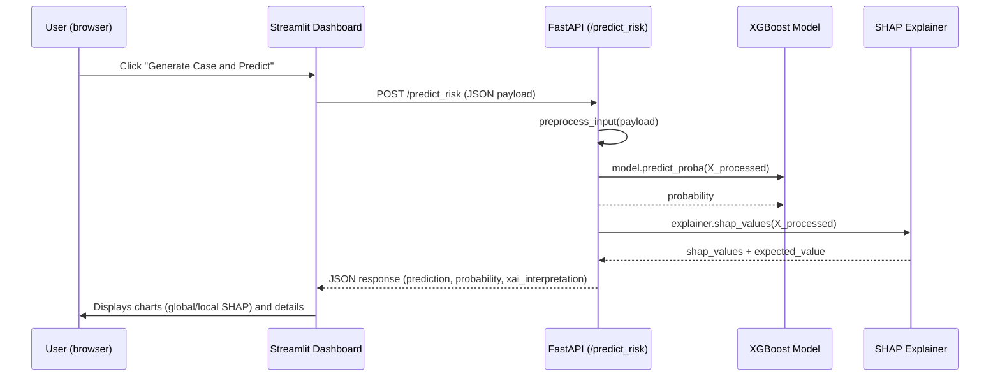
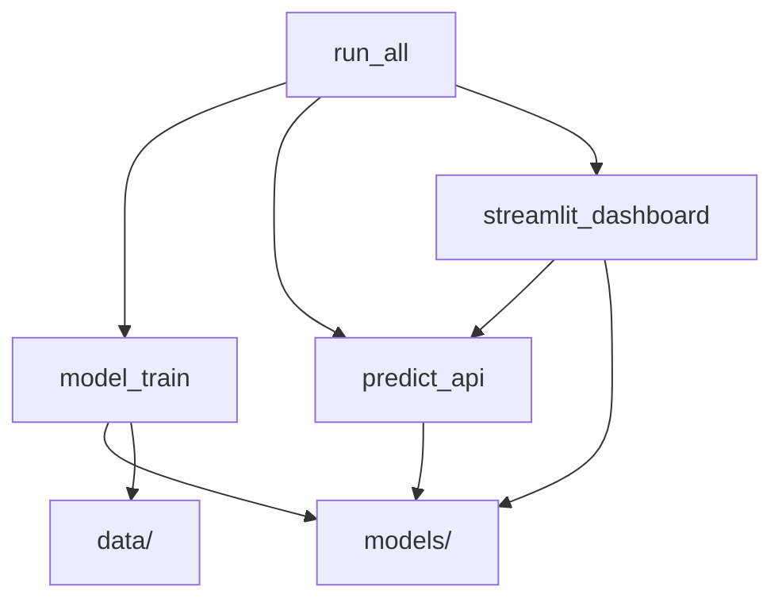

[](README.md)

# Credit Risk XAI

> Small project: credit risk classification with SHAP explanations

## Table of Contents
1. [Overview](#overview)
2. [Project Structure](#structure)
3. [Diagrams (Mermaid)](#diagrams)
4. [Quick Installation](#installation)
5. [Execution](#exe)
6. [Module Details](#details)
7. [API: `/predict_risk/` (documentation)](#api)
8. [Generated Data and Artifacts](#data)
9. [Testing and Validation](#test-val)
10. [Common Issues and Solutions](#issues)
11. [Extensions and Best Practices](#extensions)

<a name="overview"></a>
### 1. Overview

This repository implements a minimal **training + API + dashboard** pipeline for a credit risk classification model, with local explanations using **SHAP**. It is ideal as a demo/PoC to show how to integrate an XGBoost model with a FastAPI API and a Streamlit dashboard that consumes that API to display local explanations.

The general flow is:

-  `model_train.py` prepares the data, trains the model, and saves artifacts.
-  `predict_api.py` exposes a REST API that receives a case, applies preprocessing compatible with the training columns, performs inference, and returns a SHAP explanation.
-  `streamlit_dashboard.py` serves an interface that shows global evaluation (with a balanced synthetic test set) and a local prediction demo that calls the API.
- `run_all.py` orchestrates the creation of the virtual environment, dependency installation, training, and startup of the API and dashboard.

<a name="structure"></a>
### 2. Project Structure

```bash
├── model_train.py            # training and artifact generation (models/, data/)
├── predict_api.py           # FastAPI: /predict_risk/ endpoint
├── streamlit_dashboard.py   # Streamlit: dashboard that consumes the API
├── run_all.py               # orchestration script (venv, install, train, launch API and Streamlit)
├── requirements.txt         # (must exist) project dependencies
├── models/                  # generated artifacts (xgb_model.pkl, feature_names.pkl)
└── data/                    # generated data (synthetic_test_set.csv)
```

<a name="diagrams"></a>
### 3. Diagrams (Mermaid)

#### 3.1. General Architecture (high-level flow)



#### 3.2. Local Prediction Sequence (e.g., button in Streamlit)



#### 3.3. Module Dependencies


<a name="installation"></a>
### 4. Quick Installation
> Recommended: use `run_all.py` for an "all-in-one" experience (creates venv, installs packages, trains, and launches services). See the _Execution_ section for details.

If you prefer to do everything step-by-step:

```bash
# Create and activate environment (Linux/macOS)
python -m venv .venv
source .venv/bin/activate

# (Windows - Powershell)
# python -m venv .venv
# .\.venv\Scripts\Activate.ps1

# Install dependencies (make sure you have requirements.txt)
pip install -r requirements.txt
```
**Expected minimum dependencies** (add specific versions in `requirements.txt` for reproducibility):

```
fastapi
uvicorn
pandas
numpy
xgboost
scikit-learn
imbalanced-learn
joblib
shap
streamlit
plotly
matplotlib
requests
ucimlrepo
```

<a name="exe"></a>
### 5. Execution

#### Option A - Orchestrated (recommended for demo)

```bash
python run_all.py
```
`run_all.py` handles:
1. Creating a `.venv` virtual environment if it doesn't exist and running `pip install -r requirements.txt`.
2. Launching `model_train.py` to generate artifacts (model + feature_names + synthetic dataset).
3. Starting the FastAPI API (uvicorn) in the background.
4. Starting Streamlit (it will open the browser or show the URL in the console).

> **Important Note:** `uvicorn` by default starts on port `8000`. `streamlit_dashboard.py` assumes `API_URL="http://127.0.0.1:8000/predict_risk/"`. `run_all.py` prints a URL `127.0.0.1:8000` in its output, but this line is informational and **does not** reflect the default port used by `uvicorn` (8000). If you want to expose it on another port, change `API_COMMAND` in `run_all.py` or add `--port 8000`.

#### Option B - Run modules individually

- Train and generate artifacts:

```bash
python model_train.py
```

- Start the API (from the same environment where `models/` are located)

```bash
uvicorn predict_api:app --reload --host 127.0.0.1 --port 8000
```

- Run the dashboard:

```bash
streamlit run streamlit_dashboard.py
```

<a name="details"></a>
### 6. Module Details

#### `model_train.py`

- Loads the dataset from UCI (Statlog German Credit) using `ucimlrepo.fetch_ucirepo`.
- Renames columns with `COLUMN_MAPPING` for readability.
- Encodes categorical variables with `pd.get_dummies(..., drop_first=True)`.
- Trains an `xgboost.XGBClassifier` (parameters: 100 estimators, lr 0.1, `scale_pos_weight` calculated to compensate for imbalance) and saves:
  
  - `models/xgb_model.pkl` (joblib)
  - `models/feature_names.pkl` (list of column names after encoding)

- Generates a balanced `data/synthetic_test_set.csv` using `SMOTE` from the test split.

**Useful points:**

- `feature_names` is critical for `predict_api.py` to construct the input row with exactly the expected columns.

#### `predict_api.py`

- Exposes a FastAPI endpoint: `POST /predict_risk/`.
- Input structure defined by `Pydantic` (`CreditData`), with fields written in plain language (see `CreditData` in the file).
- `preprocess_input(...)` performs:

    - `pd.get_dummies` on the received row (to maintain consistency with training encoding).
    - Construction of a final DataFrame with columns in the exact order of `feature_names`, filling with 0s for missing columns.

- Inference and explanation:

    - `model.predict_proba(...)` to get the probability of risk.
    - `explainer = shap.TreeExplainer(model)` and `explainer.shap_values(...)` to get feature contributions.
    - The endpoint tries to handle multiple SHAP output formats (list/ndarray/different dimensions) and normalizes them to a list of (feature, shap_value) pairs.

- JSON response (summary):

    - `prediction`: text ("High Risk" / "Low Risk")
    - `probability_of_risk`: probability (float)
    - `xai_interpretation`: contains `base_risk_score` and `detailed_explanation` (list of factors with `factor`, `risk_impact`, `shap_magnitude`, `input_value`).

**Error messages returned by the API:**

- If `models/xgb_model.pkl` or `models/feature_names.pkl` do not exist, the endpoint returns `500` with a message indicating to run `model_train.py`.
- If `explainer` is not initialized, it also returns `500` and suggests retraining/regenerating artifacts.

#### `streamlit_dashboard.py`

- It has two modes:

    1. **Global Evaluation:** loads `data/synthetic_test_set.csv`, calculates metrics (AUC, F1), displays a confusion matrix, and a global importance plot calculated with SHAP.
    2. **Local Prediction:** takes a random case from the original dataset (obtained from UCI), converts it to native types, sends it to `POST /predict_risk/`, and displays the local explanation (bar chart) based on the response.

- Default `API_URL`: `http://127.0.0.1:8000/predict_risk/` (make sure the API is on that host/port).

<a name="api"></a>
### 7. API: `/predict_risk/` (documentation)

#### Schema (simplified) - Accepted Fields

The `CreditData` Pydantic model includes the following fields (types):

- `checking_status`: string
- `duration`: int
- `credit_history`: string
- `purpose`: string
- `credit_amount`: int
- `savings_status`: string
- `employment`: string
- `installment_commitment`: int
- `personal_status`: string
- `other_parties`: string
- `residence_since`: int
- `property_magnitude`: string
- `age`: int
- `other_payment_plans`: string
- `housing`: string
- `existing_credits`: int
- `job`: string
- `num_dependencies`: int
- `own_telephone`: string
- `foreign_worker`: string

> These fields are defined in `predict_api.py` and are expected with these exact names in the input JSON.

#### Example Request (cURL)

```bash
curl -s -X POST "http://127.0.0.1:8000/predict_risk/" \
  -H "Content-Type: application/json" \
  -d '{
    "checking_status": "no_checking",
    "duration": 12,
    "credit_history": "critical/other",
    "purpose": "radio/television",
    "credit_amount": 5000,
    "savings_status": "no_savings",
    "employment": "unemployed",
    "installment_commitment": 4,
    "personal_status": "male single",
    "other_parties": "none",
    "residence_since": 4,
    "property_magnitude": "real estate",
    "age": 35,
    "other_payment_plans": "none",
    "housing": "own",
    "existing_credits": 1,
    "job": "skilled",
    "num_dependents": 1,
    "own_telephone": "yes",
    "foreign_worker": "no"
  }'
```

#### Simplified Example Response (JSON)

```json
{
  "prediction": "Low Risk (No Default)",
  "probability_of_risk": 0.1234,
  "xai_interpretation": {
    "base_risk_score": 0.3456,
    "detailed_explanation": [
      {
        "factor": "age",
        "risk_impact": "Reduces",
        "shap_magnitude": -0.12,
        "input_value": 35
      },
      {
        "factor": "credit_amount",
        "risk_impact": "Increases",
        "shap_magnitude": 0.08,
        "input_value": 5000
      }
    ]
  },
  "status": "success"
}
```

<a name="data"></a>
### 8. Generated Data and Artifacts

- `models/xgb_model.pkl` - model serialized with `joblib`. Contains the trained XGBoost estimator.
- `models/feature_names.pkl` - list of column names after one-hot encoding. It is **essential** for the API to correctly construct input rows.
- `data/synthetic_test_set.csv` - balanced synthetic set using SMOTE, used by the dashboard for metrics and visualizations.
- `artifacts/` _(optional)_ - suggested folder to save:
  
  - `training_metrics.json`: training metrics (AUC, accuracy, recall, precision, etc.).
  - `preprocessing_pipeline.joblib`: if preprocessing is externalized using a scikit-learn `Pipeline`.

**Recommendations:**

- Models can range from 1-50 MB depending on XGBoost parameters.
- Save a hash file (e.g., `artifacts/checksums.txt`) for traceability.

<a name="test-val"></a>
### 9. Testing and Validation
#### 9.1. Recommended Tests

**Unit tests (pytest):**

- `test_preprocess_input`: check that it converts types, fills missing columns, and preserves the order of `feature_names`.
- `test_api_schema`: use FastAPI's `TestClient` to validate:

    - ✅ Valid request → 200 code and expected keys. 
    - ❌ Missing fields → 422 code (Pydantic validation).
- `test_shap_format`: verify that the SHAP output is normalized correctly.

**Integration tests:**

- Temporarily launch the API (port 9000) and have `streamlit_dashboard` consume its responses.
- Mock SHAP responses in CI/CD for speed.

**E2E tests (optional):**

- Orchestrate the API and dashboard with `docker-compose`, make a `POST /predict_risk/`, and validate the full response.

#### 9.2. Recommended Metrics

- Use a fixed `random_state` in `train_test_split`, `XGBoost`, and `SMOTE`.
- Verify `requirements.txt` with exact dependencies (`pip freeze`).
- Automate steps in a `Makefile` or within `run_all.py`.

<a name="issues"></a>
### 10. Common Issues and Solutions
#### 10.1. Artifacts Not Found

**Error:** `FileNotFoundError` when opening `xgb_model.pkl`.

**Solution:** run `python model_train.py` or check absolute paths.

#### 10.2. Inconsistent Columns

**Cause:** differences after `get_dummies` between training and inference.

**Solution:** use

```python
df = df.reindex(columns=feature_names, fill_value=0)
```
or save a `Pipeline` with the same transformer.

#### 10.3. SHAP is Slow or Incompatible

**Cause:** large model or `TreeExplainer` without `background`.

**Solution:**

- Save the already initialized explainer (`explainer.joblib`).
- Limit the number of visualized features.

#### 10.4. High API Latency

**Solution:**

- Run `uvicorn` with multiple workers (`--workers 4`).
- Use NGINX as a reverse proxy and cache responses.

#### 10.5. CORS or Port Issues

**Cause:** the dashboard (Streamlit) and the API are on different origins.

**Solution:**

Add in `predict_api.py`:
```python
from fastapi.middleware.cors import CORSMiddleware
app.add_middleware(
    CORSMiddleware,
    allow_origins=["http://localhost:8501"],
    allow_methods=["*"],
    allow_headers=["*"]
)
```

<a name="extensions"></a>
### 11. Extensions and Best Practices

- **Dockerization:**

```dockerfile
FROM python:3.10-slim
WORKDIR /app
COPY . /app
RUN pip install -r requirements.txt
CMD ["uvicorn", "predict_api:app", "--host", "0.0.0.0", "--port", "8000"]
```

- **docker-compose:** to launch API + dashboard together.
- **Configuration:** move variables (ports, paths, seeds) to `.env` or `config.py`.
- **Monitoring:** JSON logs, Prometheus metrics, OpenTelemetry traces.
- **Bias Auditing:** compare metrics by subgroups (age, employment, gender) using SHAP to interpret inequalities.
