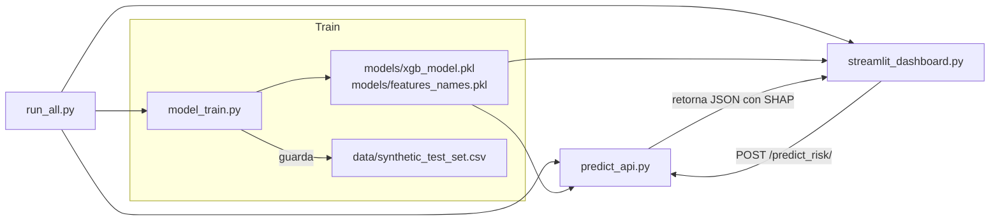
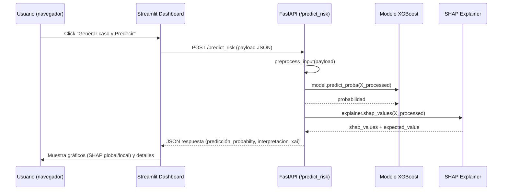
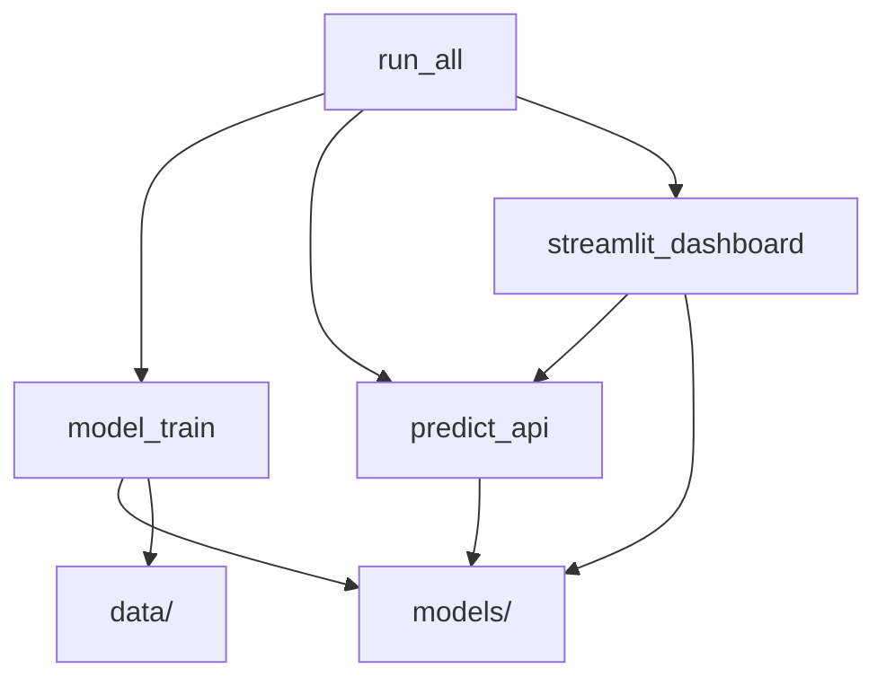

# Riesgo Crediticio XAI

> Proyecto pequeño: clasificación de riesgo crediticio con explicaciones SHAP

## Índice
1. [Visión general](#vision-general)
2. [Estructura del proyecto](#estructura)
3. [Diagramas (Mermaid)](#diagramas)
4. [Instalación rápida](#instalacion)
5. [Ejecución](#exe)
6. [Detalles por módulo](#detalles)
7. [API: `/predict_risk/` (documentación)](#api)
8. [Datos y artefactos generados](#datos)
9. [Pruebas y validación](#test-val)
10. [Problemas comunes y soluciones](#problemas)
11. [Extensiones y buenas prácticas](#extensiones)

### [1. Visión general](#vision-general)

Este repositorio implementa un pipeline mínimo de **entrenamiento + API + dashboard** para un modelo de clasificación de riesgo crediticio, con explicaciones locales mediante **SHAP**. Es ideal como demo/PoC para mostrar cómo integrar un modelo XGBoost con una API FastAPI y un dashboard Streamlit que consume esa API para mostrar explicaciones locales.

El flujo general es:

-  `model_train.py` prepara los datos, entrena el modelo y guarda artefactos.
-  `predict_api.py` expone una API REST que recibe un caso, aplica preprocesado compatible con las columnas de entrenamiento, realiza inferencia y devuelve una explicación SHAP.
-  `streamlit_dashboard.py` sirve una interfaz que muestra evaluación global (con conjunto sintético balanceado) y una demo de predicción local que llama a la API.
- `run_all.py` orquesta la creación del entorno virtual, la instalación de dependencias, el entrenamiento, el arranque de la API y el dashboard.

### [2. Estructura del proyecto](#estructura)

```bash
├── model_train.py            # entrenamiento y generación de artefactos (models/, data/)
├── predict_api.py           # FastAPI: endpoint /predict_risk/
├── streamlit_dashboard.py   # Streamlit: dashboard que consume la API
├── run_all.py               # script de orquestación (venv, instalar, entrenar, levantar API y Streamlit)
├── requirements.txt         # (debe existir) dependencias del proyecto
├── models/                  # artefactos generados (xgb_model.pkl, feature_names.pkl)
└── data/                    # datos generados (synthetic_test_set.csv)
```

### [3. Diagramas (Mermaid)](#diagramas)

#### 1) Arquitectura general (flujo alto nivel)



#### 2) Secuencia de una predicción local (ej. botón en Streamlit)



#### 3) Dependencias entre módulos



### [4. Instalación rápida](#instalacion)
> Recomendado: usar `run_all.py` para una experiencia "todo en uno" (crea venv, instala paquetes, entrena y levanta servicios). Ver la sección _Ejecución_ para detalles.

Si prefieres hacer todo paso a paso:

```bash
# Crear y activar entorno (Linux/macOS)
python -m venv .venv
source .venv/bin/activate

# (Windows - Powershell)
# python -m venv .venv
# .\.venv\Scripts\Activate.ps1

# Instalar dependencias (asegúrate de tener requirements.txt)
pip install -r requirements.txt
```
**Dependencias mínimas esperadas** (añade versiones concretas en `requirements.txt` para reproducibilidad):

```
fastapi
uvicorn
pandas
numpy
xgboost
scikit-learn
imbalanced-learn
joblib
shap
streamlit
plotly
matplotlib
requests
ucimlrepo
```

### [5. Ejecución](#exe)

#### Opción A - Orquestado (recomendado para demo)

```bash
python run_all.py
```
`run_all.py` se encarga de:
1. Crear un entorno virtual `.venv` si no existe y ejecutar `pip install -r requirements.txt`.
2. Lanzar `model_train.py` para generar los artefactos (modelo + feature_names + dataset sintético).
3. Iniciar la API de FastAPI (uvicorn) en segundo plano.
4. Iniciar Streamlit (abrirá el navegador o mostrará la URL en consola).

> **Observación importante:** `uvicorn` por defecto arranca en el puerto `8000`. `streamlit_dashboard.py` asume `API_URL="http://127.0.0.1:8000/predict_risk/"`. `run_all.py` imprime una URL `127.0.0.1:8000` en su salida, pero esa línea es informativa y **no** refleja el puerto por defecto usado por `uvicorn` (8000). Si deseas exponerlo en otro puerto cambia `API_COMMAND` en `run_all.py` o añade `--port 8000`. 

#### Opción B - Ejecutar módulos individualmente

- Entrenar y generar artefactos:

```bash
python model_train.py
```

- Levantar la API (desde el mismo entorno donde están `models/`)

```bash
uvicorn predict_api:app --reload --host 127.0.0.1 --port 8000
```

- Ejecutar el dashboard:

```bash
streamlit run streamlit_dashboard.py
```

### [6. Detalles por módulo](#detalles)

#### `model_train.py`

- Carga el dataset de UCI (Statlog German Credict) usando `ucimlrepo.fetch_ucirepo`.
- Renombra las columnas con `COLUMN_MAPPING` para legibilidad.
- Codifica variables categóricas con `pd.get_dummies(..., drop_first=True)`.
- Entrena un `xgboost.XGBClassifier` (parámetros: 100 estimators, lr 0.1, `scale_pos_weight` calculado para compensar desequilibrio) y guarda:
  
  - `models/xgb_model.pkl` (joblib)
  - `models/feature_names.pkl` (lista de nombres de columnas después de encoding)

- Genera un `data/synthetic_test_set.csv` balanceado mediante `SMOTE` a partir del split de prueba.

**Puntos útiles:**

- `feature_names` es crítico para que `predict_api.py` construya la fila de entrada con exactamente las columnas esperadas.

#### `predict_api.py`

- Exposición de FastAPI con un endpoint: `POST /predict_risk/`.
- Estructura de entrada definida por `Pydantic` (`CreditData`), con campos que están escritos en claro (ver `CreditData` en el fichero).
- `preprocess_input(...)` realiza:

    - `pd.get_dummies` sobre la fila recibida (para mantener la consistencia con el training encoding).
    - Construcción de un DataFrame final con columnas exactamente en el orden de `feature_names` rellenando 0s para columnas ausentes.

- Inferencia y explicación:

    - `model.predict_proba(...)` para obtener la probabilidad de riesgo.
    - `explainer = shap.TreeExplainer(model)` y `explainer.shap_values(...)` para obtener contribuciones por feature.
    - El endpoint intenta manejar múltiples formatos de salida de SHAP (list/ndarray/dimensiones diferentes) y normalizamos a una lista de pares (feature, shap_value).

- Respuesta JSON (resumen):

    - `prediction`: texto ("Alto Riesgo" / "Bajo Riesgo")
    - `probabilty_of_risk`: probabilidad (float)
    - `interpretacion_xai`: contiene `base_risk_score` y `explicacion_detallada` (lista de factores con `factor`, `impacto_riesgo`, `magnitud_shap`, `valor_input`).

**Mensajes de error devueltos por la API:**

- Si `models/xgb_model.pkl` o `models/feature_names.pkl` no existen, el endpoint devuelve `500` con mensaje indicando que se ejecute `model_train.py`.
- Si `explainer` no está inicializado, también devuelve `500` y sugiere reentrenar/regenerar artefactos.

#### `streamlit_dashboard.py`

- Tiene dos modos:

    1. **Evaluación Global:** carga `data/synthetic_test_set.csv`, calcula métricas (AUC, F1), muestra matriz de confusión y gráfico de importancia global calculado con SHAP.
    2. **Predicción Local:** toma un caso aleatorio del dataset original (obtenido desde UCI), lo convierte a tipos nativos, lo envía a `POST /predict_risk/` y muestra la explicación local (gráfico tipo barra) basada en la respuesta.

- `API_URL` por defecto: `http://127.0.0.1:8000/predict_risk/` (asegúrate de que la API esté en ese host/puerto).

### [7. API: `/predict_risk/` (documentación)](#api)

#### Esquema (simplificado) - Campos aceptados

El Pydantic `CreditData` incluye los siguientes campos (tipos):

- `checking_status`: string
- `duration`: int
- `credit_history`: string
- `purpose`: string
- `credit_amount`: int
- `savings_status`: string
- `employment`: string
- `installment_commitment`: int
- `personal_status`: string
- `other_parties`: string
- `residence_since`: int
- `property_magnitude`: string
- `age`: int
- `other_payment_plans`: string
- `housing`: string
- `existing_credits`: int
- `job`: string
- `num_dependencies`: int
- `own_telephone`: string
- `foreign_worker`: string

> Estos campos están definidos en `predict_api.py` y se esperan exactamente esos nombres en el JSON de entrada.

#### Ejemplo de petición (cURL)

```bash
curl -s -X POST "http://127.0.0.1:8000/predict_risk/" \
  -H "Content-Type: application/json" \
  -d '{
    "checking_status": "no_checking",
    "duration": 12,
    "credit_history": "critical/other",
    "purpose": "radio/television",
    "credit_amount": 5000,
    "savings_status": "no_savings",
    "employment": "unemployed",
    "installment_commitment": 4,
    "personal_status": "male single",
    "other_parties": "none",
    "residence_since": 4,
    "property_magnitude": "real estate",
    "age": 35,
    "other_payment_plans": "none",
    "housing": "own",
    "existing_credits": 1,
    "job": "skilled",
    "num_dependents": 1,
    "own_telephone": "yes",
    "foreign_worker": "no"
  }'
```

#### Ejemplo simplificado de respuesta (JSON)

```json
{
  "prediction": "Bajo Riesgo (No Impago)",
  "probability_of_risk": 0.1234,
  "interpretacion_xai": {
    "base_risk_score": 0.3456,
    "explicacion_detallada": [
      {
        "factor": "age",
        "impacto_riesgo": "Reduce",
        "magnitud_shap": -0.12,
        "valor_input": 35
      },
      {
        "factor": "credit_amount",
        "impacto_riesgo": "Aumenta",
        "magnitud_shap": 0.08,
        "valor_input": 5000
      }
    ]
  },
  "status": "succes
}
```

### [8. Datos y artefactos generados](#datos)

- `models/xgb_model.pkl` - modelo serializado con `joblib`. Contiene el estimador XGBoost entrenado.
- `models/feature_names.pkl` - lista de nombres de columnas tras el _one-hot encoding_. Es **fundamental** para que la API construya correctamente las filas de entrada.
- `data/synthetic_test_set.csv` - conjunto sintético _balanceado_ mediante SMOTE, utilizado por el dashboard para métricas y visualizaciones.
- `artifacts/` _(opcional)_ - carpeta sugerida para guardar:
  
  - `training_metrics.json`: métricas del entrenamiento (AUC, accuracy, recall, precisión, etc.).
  - `preproccesing_pipeline.joblib`: si se externaliza el preprocesado mediante un `Pipeline` de scikit-learn.

**Recomendaciones:**

- Los modelos pueden ocupar entre 1-50 MB según parámetros del XGBoost.
- Guarda un fichero de hashes (por ejemplo `artifacts/checksums.txt`) para trazabilidad.

### [9. Pruebas y validación](#test-val)
#### 9.1. Tests recomendados

**Unit tests (pytest):**

- `test_preprocess_input`: comprobar que convierte tipos, rellena columnas faltantes y preserva el orden de `feature_names`.
- `test_api_schema`: usar `TestClient` de FastAPI para validar:

    - ✅ Petición válida → código 200 y claves esperadas. 
    - ❌ Campos ausentes → código 422 (validación Pydantic).
- `test_shap_format`: verificar que la salida de SHAP se normaliza correctamente.

**Integration tests:**

- Levantar la API temporalmente (puerto 9000) y que `streamlit_dashboard` consuma sus respuestas.
- Mockear respuestas SHAP en CI/CD si se quiere rapidez.

**E2E tests (opcional):**

- Orquestar con `docker-compose` la API y el dashboard, hacer un `POST /predict_risk/` y validar la respuesta completa.

#### 9.2. Métricas recomendadas

- Usar `random_state` fijo en `train_test_split`, `XGBoost` y `SMOTE`.
- Verificar `requirements.txt` con dependencias exactas (`pip freeze`)
- Automatizar pasos en un `Makefile` o dentro de `run_all.py`.

### [10. Problemas comunes y soluciones](#problemas)
#### 10.1. Artefactos no encontrados

**Error:** `FileNotFoundError` al abrir `xgb_model.pkl`.

**Solución:** ejecutar `python model_train.py` o revisar rutas absolutas.

#### 10.2. Columnas incosistentes

**Causa:** diferencias tras `get_dummies` entre entrenamiento e inferencia.

**Solución:** usar

```python
df = df.reindex(columns=feature_names, fill_value=0)
```
o guarda un `Pipeline` con el mismo transformador.

#### 10.3. SHAP lento o incompatible

**Causa:** modelo grande o `TreeExplainer` sin `background`.

**Solución:**

- Guardar el explainer (`explainer.joblib`) ya inicializado.
- Limitar el número de _features_ visualizadas.

#### 10.4. Latencia alta en API

**Solución:**

- Ejecutar `uvicorn` con varios workers (`--workers 4`).
- Poner NGINX como proxy inverso y cachear respuestas.

#### 10.5. Problemas CORS o de puerto

**Causa:** el dashboard (Streamlit) y la API están en distintos orígenes.

**Solución:**

Agregar en `predict_api.py`:
```python
from fastapi.middleware.cors import CORSMiddleware
app.add_middleware(
    CORSMiddleware,
    allow_origins=["http://localhost:8501"],
    allow_methods=["*"],
    allow_headers=["*"]
)
```

### [11. Extensiones y buenas prácticas](#extensiones)

- **Dockerización:**

```dockerfile
FROM python:3.10-slim
WORKDIR /app
COPY . /app
RUN pip install -r requirements.txt
CMD ["uvicorn", "predict_api:app", "--host", "0.0.0.0", "--port", "8000"]
```

- **docker-compose:** para levantar API + dashboard conjuntamente.
- **Configuración:** mover variables (puertos, rutas, seeds) a `.env` o `config.py`.
- **Monitorización:** logs JSON, métricas Prometheus, trazas OpenTelemetry.
- **Auditoría de sesgos:** comparar métricas por subgrupos (edad, empleo, género) usando SHAP para interpretar desigualdades.